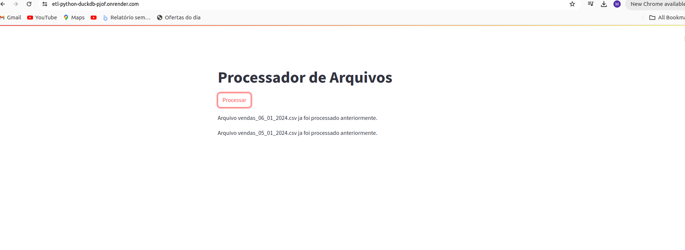

 ## **ETL usando Python e DuckDB**

 #### A ideia central deste treinamento foi compreender como construir uma pipeline que irá pegar arquivos de diversos tipos (csv, json e parquet) no Google Drive e levá-los a um banco de dados Postgres.

 

 #### Na parte de transformação optou-se por simplismente criar uma nova coluna com o total de vendas (quantidade * preço).

 #### Por fim foi feito o deploy da APP usando a free tier do Render.

 
 